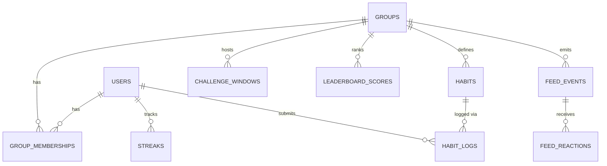

# Rivals — Architecture & Timeline

> **One-liner:** A cross-platform group habit tracker where every completion is verified by a live, timestamped proof photo and displayed on a real-time leaderboard — so friends hold each other accountable with proof, not promises.
> **Generated from PRD on:** 2026-04-23 (Master PRD v1.0)
> **Status:** Planning

---

## 1. Project Overview

**Purpose:** Rivals turns solo habit building into a group sport. Admins define daily habits, every member must log a live camera photo (with an on-image timestamp watermark) to mark completion, and a live leaderboard ranks members by streak, total completions, or a time-boxed challenge window. The product eliminates self-report cheating by never allowing gallery uploads and by validating server-side that the photo was taken within a 5-minute window of "now".

**Target Users:**
- Aryan, The Friend-Group Organizer (primary): runs a tight group, wants enforced accountability with provable completions.
- Shreya, The Reluctant Habit Builder: needs external social pressure because solo tracking has always failed for her.
- Rohan, The Competitive High-Achiever: wants a real leaderboard with real proof so his consistency is visibly rewarded.

**Success Metrics (from PRD §12 — inferred headline set):**
- D7 retention of invited members ≥ 40%.
- Median group has ≥ 3 active members after week 2.
- ≥ 70% of completed habits logged within a 10-minute window of the user's configured reminder.
- Proof-photo rejection rate (clock-skew / upload failure) < 2%.
- P95 leaderboard render latency after a log < 90 seconds (one polling cycle + network).

**Non-Goals (Explicitly Out of Scope for v1.0):**
- Public social features: no public profiles, no follower graph, no content discovery.
- Non-daily habit frequencies (e.g., 3x/week). Every habit is daily.
- Member-suggested or voted habits — admin has sole authority.
- Any paid tier, subscription, or premium feature. Everything is free in v1.0.
- GPS / device-sensor based proof. Watermarked photo + server timestamp only.
- Real-time WebSocket transport — polling every 60s is the MVP contract.

---

## 2. System Architecture

### 2.1 Tech Stack

| Layer         | Choice                                    | Why                                                                                |
|---------------|-------------------------------------------|------------------------------------------------------------------------------------|
| Mobile        | React Native (Expo managed)               | One codebase for iOS + Android; `expo-camera` supports gallery-blocked capture.    |
| Web           | React Native Web (via Expo for Web)       | Share UI code with mobile for full feature parity with near-zero divergence.       |
| API           | Node.js 20 + Fastify                      | Fast, small-footprint, great TypeScript support, cheap to host.                    |
| Database      | Supabase PostgreSQL                       | Managed Postgres + Auth + Storage on a free tier; RLS is first-class.              |
| ORM           | Drizzle ORM                               | Typed SQL, migrations-as-code, low-magic. Plays well with Supabase.                |
| Auth          | Supabase Auth (email + Google OAuth)      | Email, OAuth, email verification, JWT issuance out of the box.                     |
| Object store  | Cloudflare R2                             | 10 GB free, zero egress fees; presigned URLs keep photos access-controlled.        |
| Client state  | Zustand                                   | Minimal, non-opinionated global state for UI.                                      |
| Server state  | TanStack React Query                      | Cache, polling, background refetch, offline persistence.                           |
| Navigation    | React Navigation 6                        | Standard, bottom-tabs + nested stacks.                                             |
| Push          | Firebase Cloud Messaging + APNs           | FCM unifies Android + iOS delivery; Web Push via service worker or FCM Web SDK.    |
| Scheduling    | Supabase pg_cron                          | In-database cron — no Redis, no BullMQ, zero extra infra at MVP scale.             |
| Observability | Sentry                                    | Crash + error reporting for mobile, web, and API.                                  |
| Hosting       | Railway or Render (API) + Cloudflare Pages (web) | Cheap always-on tiers; CI/CD from GitHub.                                          |
| Monorepo      | pnpm workspaces + Turborepo               | Fast builds, shared TS types between `apps/mobile`, `apps/web`, `packages/api`.     |

Confirmed by the PRD: **Supabase + Cloudflare R2**. Deferred: final API host (Railway vs. Render vs. Fly.io) — decided at Phase 1 kickoff.

### 2.2 Folder Structure

```
rivals/
├── apps/
│   ├── mobile/                        # Expo managed RN app (iOS + Android)
│   │   ├── app/                       # Expo Router routes (or src/screens for RN6)
│   │   ├── components/
│   │   ├── hooks/
│   │   └── app.config.ts
│   └── web/                           # Expo for Web shell (RN Web)
│       ├── public/
│       └── src/
├── packages/
│   ├── api/                           # Fastify API (modular monolith)
│   │   ├── src/
│   │   │   ├── modules/
│   │   │   │   ├── auth/
│   │   │   │   ├── users/
│   │   │   │   ├── groups/
│   │   │   │   ├── habits/
│   │   │   │   ├── logs/
│   │   │   │   ├── leaderboard/
│   │   │   │   ├── feed/
│   │   │   │   ├── notifications/
│   │   │   │   └── gamification/
│   │   │   ├── plugins/               # Fastify plugins (auth, errors, rate-limit)
│   │   │   ├── db/                    # Drizzle schema + migrations
│   │   │   ├── jobs/                  # pg_cron + in-process workers (if any)
│   │   │   └── server.ts
│   │   └── drizzle.config.ts
│   ├── shared/                        # Types, zod schemas, shared utils
│   │   ├── src/types/
│   │   └── src/zod/
│   └── ui/                            # RN components shared by mobile + web
├── infra/
│   ├── supabase/                      # Migrations, RLS, pg_cron seeds
│   └── r2/                            # R2 bucket config, CORS rules
├── Vibe Code/                         # This planning folder
├── .github/workflows/                 # CI (lint, type, test, deploy)
├── pnpm-workspace.yaml
├── turbo.json
└── AGENTS.md
```

### 2.3 Data Model

Every entity below maps directly to a Drizzle table. All tables have `created_at timestamptz default now()`; entities that can be soft-deleted have `deleted_at timestamptz`.

**users**
| Field          | Type         | Constraints                          | Notes                                        |
|----------------|--------------|--------------------------------------|----------------------------------------------|
| id             | uuid PK      | default gen_random_uuid()            | Mirrors Supabase `auth.users.id`             |
| username       | citext       | UNIQUE, not null, regex `^[a-z0-9_]{3,24}$` | Globally unique, case-insensitive            |
| display_name   | text         | not null                             |                                              |
| email          | citext       | UNIQUE, not null                     | From Supabase Auth                           |
| avatar_url     | text         | nullable                             | Supabase Storage URL                         |
| timezone       | text         | not null, default 'UTC'              | IANA tz, used for local-day computation      |
| created_at     | timestamptz  | default now()                        |                                              |
| deleted_at     | timestamptz  | nullable                             | Soft delete → 90-day purge                   |

**groups**
| Field            | Type        | Constraints            | Notes                                             |
|------------------|-------------|------------------------|---------------------------------------------------|
| id               | uuid PK     |                        |                                                   |
| name             | text        | not null, 1-80 chars   |                                                   |
| description      | text        | nullable               |                                                   |
| avatar_url       | text        | nullable               |                                                   |
| admin_user_id    | uuid FK→users.id | not null          | Sole admin; transferable                          |
| reference_tz     | text        | not null               | Used for challenge window boundaries              |
| leaderboard_mode | enum        | 'streak' \| 'total' \| 'window' default 'streak' |                                                   |
| invite_code      | text        | UNIQUE, not null       | Alphanumeric, 8 chars                             |
| created_at       | timestamptz | default now()          |                                                   |
| deleted_at       | timestamptz | nullable               |                                                   |

**group_memberships**
| Field        | Type        | Constraints                      | Notes                                 |
|--------------|-------------|----------------------------------|---------------------------------------|
| id           | uuid PK     |                                  |                                       |
| group_id     | uuid FK     | not null                         |                                       |
| user_id      | uuid FK     | not null                         |                                       |
| role         | enum        | 'admin' \| 'member'              |                                       |
| joined_at    | timestamptz | default now()                    | Reset on rejoin — used by Total mode  |
| left_at      | timestamptz | nullable                         | Leaving preserves history             |
|              |             | UNIQUE(group_id, user_id) WHERE left_at IS NULL | Prevents dup active membership |

**habits**
| Field           | Type        | Constraints                 | Notes                                               |
|-----------------|-------------|-----------------------------|-----------------------------------------------------|
| id              | uuid PK     |                             |                                                     |
| group_id        | uuid FK     | not null                    |                                                     |
| name            | text        | not null, 1-60 chars        |                                                     |
| description     | text        | nullable                    |                                                     |
| grace_days      | smallint    | 0 ≤ x ≤ 2, default 0        |                                                     |
| is_active       | boolean     | default true                | Deactivation keeps history, hides card              |
| created_at      | timestamptz |                             |                                                     |

**habit_logs**
| Field              | Type        | Constraints                        | Notes                                                         |
|--------------------|-------------|------------------------------------|---------------------------------------------------------------|
| id                 | uuid PK     |                                    |                                                               |
| habit_id           | uuid FK     | not null                           |                                                               |
| user_id            | uuid FK     | not null                           |                                                               |
| group_id           | uuid FK     | not null                           | Denormalized for fast group-wide daily queries                |
| log_date           | date        | not null                           | User-local calendar date                                      |
| client_timestamp   | timestamptz | not null                           | ISO from client, for watermark display                         |
| server_timestamp   | timestamptz | not null, default now()            | Authoritative                                                 |
| photo_url          | text        | not null                           | R2 object key                                                 |
| deleted_at         | timestamptz | nullable                           | Same-day re-submission soft-deletes prior                     |
|                    |             | UNIQUE(habit_id, user_id, log_date) WHERE deleted_at IS NULL |                                                               |

**streaks**
| Field              | Type        | Constraints                       | Notes                               |
|--------------------|-------------|-----------------------------------|-------------------------------------|
| id                 | uuid PK     |                                   |                                     |
| user_id            | uuid FK     | not null                          |                                     |
| group_id           | uuid FK     | not null                          |                                     |
| habit_id           | uuid FK     | nullable                          | null = group-level combined streak  |
| current_streak     | integer     | default 0                         |                                     |
| longest_streak     | integer     | default 0                         | Permanent, never resets             |
| last_completed_date| date        | nullable                          |                                     |
|                    |             | UNIQUE(user_id, group_id, habit_id) |                                     |

**leaderboard_scores**
| Field               | Type        | Constraints                        | Notes                                  |
|---------------------|-------------|------------------------------------|----------------------------------------|
| id                  | uuid PK     |                                    |                                        |
| group_id            | uuid FK     | not null                           |                                        |
| user_id             | uuid FK     | not null                           |                                        |
| mode                | enum        | 'streak' \| 'total' \| 'window'    |                                        |
| challenge_window_id | uuid FK     | nullable                           | Required when mode='window'            |
| score               | integer     | not null default 0                 | Streak days OR completions OR window completions |
| updated_at          | timestamptz | default now()                      |                                        |
|                     |             | UNIQUE(group_id, user_id, mode, challenge_window_id) |                                        |

**challenge_windows**
| Field          | Type        | Constraints                     | Notes                                           |
|----------------|-------------|---------------------------------|-------------------------------------------------|
| id             | uuid PK     |                                 |                                                 |
| group_id       | uuid FK     | not null                        |                                                 |
| name           | text        | not null                        |                                                 |
| start_date     | date        | not null                        | Interpreted in group.reference_tz               |
| end_date       | date        | not null                        | Must be ≥ start_date + 2                        |
| status         | enum        | 'upcoming'\|'active'\|'completed'|                                                 |
| winner_user_id | uuid FK     | nullable                        | Populated at window end                         |

**feed_events**
| Field          | Type        | Constraints                      | Notes                                              |
|----------------|-------------|----------------------------------|----------------------------------------------------|
| id             | uuid PK     |                                  |                                                    |
| group_id       | uuid FK     | not null                         |                                                    |
| actor_user_id  | uuid FK     | not null                         |                                                    |
| kind           | enum        | 'log'\|'streak_milestone'\|'badge'\|'join'\|'leave'\|'window_start'\|'window_end' |                                                    |
| payload_json   | jsonb       | not null                         | Shape depends on kind                              |
| created_at     | timestamptz | default now()                    |                                                    |

**feed_reactions**
| Field          | Type        | Constraints                                   | Notes                |
|----------------|-------------|-----------------------------------------------|----------------------|
| id             | uuid PK     |                                               |                      |
| feed_event_id  | uuid FK     | not null                                      |                      |
| user_id        | uuid FK     | not null                                      |                      |
| emoji          | text        | not null, 1-8 chars                           |                      |
|                |             | UNIQUE(feed_event_id, user_id)                | One reaction per user per card |

**notifications**
| Field          | Type        | Constraints                    | Notes                                |
|----------------|-------------|--------------------------------|--------------------------------------|
| id             | uuid PK     |                                |                                      |
| user_id        | uuid FK     | not null                       |                                      |
| kind           | enum        | see PRD EPIC 7                 |                                      |
| payload_json   | jsonb       | not null                       |                                      |
| read_at        | timestamptz | nullable                       |                                      |

**push_tokens**
| Field          | Type        | Constraints                       | Notes                            |
|----------------|-------------|-----------------------------------|----------------------------------|
| id             | uuid PK     |                                   |                                  |
| user_id        | uuid FK     | not null                          |                                  |
| platform       | enum        | 'ios'\|'android'\|'web'           |                                  |
| token          | text        | not null                          | APNs / FCM / Web Push endpoint   |
|                |             | UNIQUE(user_id, token)            |                                  |

**badges** + **user_badges**
| Field          | Type        | Constraints                    | Notes                  |
|----------------|-------------|--------------------------------|------------------------|
| id             | uuid PK     |                                |                        |
| code           | text        | UNIQUE, not null               | e.g. `streak_7`        |
| title          | text        | not null                       |                        |
| description    | text        | not null                       |                        |

| Field          | Type        | Constraints                             | Notes                           |
|----------------|-------------|-----------------------------------------|---------------------------------|
| user_id        | uuid FK     | not null                                |                                 |
| badge_id       | uuid FK     | not null                                |                                 |
| group_id       | uuid FK     | nullable                                | Some badges are group-scoped    |
| awarded_at     | timestamptz | default now()                           |                                 |
|                |             | UNIQUE(user_id, badge_id, group_id)     |                                 |

**Relationships (summary):**
- `users` 1-* `group_memberships` *-1 `groups`
- `groups` 1-* `habits` 1-* `habit_logs` *-1 `users`
- `groups` 1-* `challenge_windows`
- `groups` 1-* `leaderboard_scores` (per user, per mode)
- `groups` 1-* `feed_events` 1-* `feed_reactions`



### 2.4 Key Indexes

- `habit_logs(user_id, habit_id, log_date)` — daily completion checks
- `habit_logs(group_id, log_date DESC)` — group-wide daily feed
- `streaks(user_id, habit_id, group_id)` UNIQUE — fast streak lookups
- `feed_events(group_id, created_at DESC)` — paginated feed
- `group_memberships(user_id)` and UNIQUE(group_id, user_id) where left_at IS NULL — multi-group
- `leaderboard_scores(group_id, mode, challenge_window_id, score DESC)` — ranked reads

### 2.5 Key API Contracts

All routes return JSON; all authenticated routes require `Authorization: Bearer <JWT>`. Validation via zod schemas in `packages/shared/src/zod`.

| Method | Endpoint                                   | Purpose                                           | Auth          |
|--------|--------------------------------------------|---------------------------------------------------|---------------|
| POST   | /auth/signup                               | Email + password signup, username chosen          | No            |
| POST   | /auth/login                                | Email or OAuth login                              | No            |
| POST   | /auth/logout-all                           | Revoke all refresh tokens                         | Yes           |
| GET    | /me                                        | Current user profile                              | Yes           |
| PATCH  | /me                                        | Update display name, avatar, timezone             | Yes           |
| POST   | /groups                                    | Create group                                      | Yes           |
| GET    | /groups                                    | List groups the user is in                       | Yes           |
| GET    | /groups/:id                                | Group detail + membership                        | Yes (member)  |
| PATCH  | /groups/:id                                | Edit group (admin)                                | Yes (admin)   |
| POST   | /groups/:id/invite                         | Create invite by username or regen link/code     | Yes (admin)   |
| POST   | /groups/join                               | Join by invite code                               | Yes           |
| POST   | /groups/:id/transfer                       | Transfer admin                                    | Yes (admin)   |
| POST   | /groups/:id/leave                          | Leave (admins must transfer first)                | Yes           |
| POST   | /groups/:id/habits                         | Create habit                                      | Yes (admin)   |
| PATCH  | /habits/:id                                | Edit or deactivate habit                          | Yes (admin)   |
| GET    | /groups/:id/habits/today                   | Today's habit cards for current user              | Yes (member)  |
| POST   | /logs/upload-url                           | Request R2 presigned PUT + upload_id              | Yes (member)  |
| POST   | /logs                                      | Confirm upload, validate timestamps, write log    | Yes (member)  |
| DELETE | /logs/:id                                  | Same-day delete (soft)                            | Yes (owner)   |
| GET    | /groups/:id/leaderboard                    | Current leaderboard in active mode                | Yes (member)  |
| GET    | /groups/:id/feed                           | Paginated activity feed                           | Yes (member)  |
| POST   | /feed/:id/react                            | Add/replace emoji reaction                        | Yes (member)  |
| POST   | /groups/:id/challenges                     | Create challenge window                           | Yes (admin)   |
| POST   | /push/register                             | Register FCM/APNs/WebPush token                   | Yes           |
| PATCH  | /me/notifications                          | Update preferences                                | Yes           |
| POST   | /me/export                                 | Request GDPR data export                          | Yes           |
| DELETE | /me                                        | Account deletion cascade                          | Yes           |

### 2.6 Auth & Permissions Strategy

- **Provider:** Supabase Auth. Email/password + Google OAuth. Email verification required before first group action.
- **Session model:** short-lived JWT (1 h) + rotating refresh token (30 d). "Log out from all devices" revokes refresh family.
- **Roles:** `admin` (per group) and `member`. Platform-wide roles are out of scope.
- **Row-Level Security:** ENABLED on every table. Deny-by-default. Policies enforce "can only read rows where a membership row exists linking you to the group". Admin-write policies gated on `groups.admin_user_id = auth.uid()`.
- **Group isolation:** every group-scoped query MUST include `group_id` predicate; RLS is the belt-and-suspenders layer.

### 2.7 Hosting & Deploy Strategy

- **API:** Railway (or Render) — container, always-on $5 tier. GitHub Actions → build → deploy on push to `main` (prod) and `staging` branches.
- **Web:** Cloudflare Pages via Expo export. Preview deploys per PR.
- **Mobile:** EAS Build for iOS/Android; TestFlight + Play Internal for pre-launch.
- **DB:** Supabase managed PG (free tier → small paid tier at scale). PgBouncer pooling on by default.
- **Object store:** Cloudflare R2, single bucket `rivals-proofs`, CORS locked to the API origin + app origin.
- **Env vars (placeholders):** `SUPABASE_URL`, `SUPABASE_SERVICE_ROLE_KEY`, `SUPABASE_ANON_KEY`, `R2_ACCESS_KEY_ID`, `R2_SECRET_ACCESS_KEY`, `R2_BUCKET`, `R2_PUBLIC_BASE_URL`, `JWT_SECRET`, `FCM_SERVER_KEY`, `APNS_KEY_ID`, `APNS_TEAM_ID`, `SENTRY_DSN`.

---

## 3. Phased Timeline

Effort percentages are relative to the total MVP build. These mirror the seven phases in PRD §13.

### Phase 1: Foundation & Infrastructure [~18%]
**Goal:** Empty monorepo deploys end-to-end; a user can sign up, log in, view profile, and log out on all three platforms.
- pnpm monorepo + Turborepo scaffold: `apps/mobile`, `apps/web`, `packages/api`, `packages/shared`, `packages/ui`.
- Supabase project provisioned; all v1 tables migrated via Drizzle; RLS enabled deny-by-default.
- Fastify API booting, `/health` live, protected routes wired to Supabase JWT.
- Auth E2E: email signup (with verification), Google OAuth, username uniqueness, logout-all.
- React Navigation bottom tabs on all three platforms.
- Zustand + React Query configured; React Query persistent cache via AsyncStorage (mobile) and localStorage (web).
- CI (lint, typecheck, test) + CD to staging on every push.
- Sentry wired to API, mobile, and web.

**Checkpoint:** Blank shells deploy; auth works; `/health` returns 200 in staging.

### Phase 2: Groups & Habit Management [~14%]
**Goal:** Admins can create a group, invite members, and define habits that render on the dashboard.
- Create/edit/delete group with avatar, description, reference timezone.
- Membership management: invite-by-username, invite-link + 8-char code, accept/decline.
- Multi-group membership + "Groups" tab with stats.
- Admin controls: remove member, transfer admin, leave guard.
- Habit create/edit/deactivate by admin (name, description, grace 0/1/2).
- Dashboard renders today's habit cards (pending / complete / in-grace) without camera yet.

**Checkpoint:** Admin creates a group, invites a user by username, user accepts, both see the same habit list.

### Phase 3: Proof Photo & Habit Logging [~22%] — CORE LOOP
**Goal:** The proof system works end-to-end on all three platforms; it is the single most important vertical slice.
- `expo-camera` integration with gallery blocked; camera-only UI.
- Client-side watermark burn-in (date, time, `@username`, habit name) via `expo-image-manipulator` / canvas.
- API issues R2 presigned PUT URL; client uploads directly to R2.
- `/logs` confirms upload, validates `|server_ts - client_ts| ≤ 5 min`, writes `habit_logs`, fires feed event.
- Same-day re-submission (soft-delete prior) before midnight in user's local timezone.
- Midnight lock: no edits to prior-day logs.
- Grace-period logic: streak protected for N days; reset on expiry.
- Browser camera parity via `MediaDevices.getUserMedia` + canvas watermark.

**Checkpoint:** Across iOS + Android + Chrome, a user can tap Complete, capture a photo, see the watermark, and the log persists. Uploads with skewed client clocks (>5 min) are rejected.

### Phase 4: Leaderboard & Real-Time Engine [~14%]
**Goal:** All three leaderboard modes compute correctly and refresh via 60-second polling.
- Leaderboard Module: score computation on each log for streak, total, and window modes (synchronous recompute into `leaderboard_scores`).
- Tie-breaking rules implemented and explained in a tooltip.
- Challenge window: admin create, countdown timer, score tracking, winner declaration + badge + feed event at end.
- Historical windows archived and viewable.
- Polling: React Query `refetchInterval: 60_000` on leaderboard + feed queries; pull-to-refresh everywhere.
- Admin mode switch in Group Settings; past-mode data retained.
- "Minimum Members Gate": empty-state copy prompts invites.

**Checkpoint:** Two users log in different modes; the leaderboard re-ranks within one 60-second cycle or immediately on pull-to-refresh. Winner declared correctly when a challenge window ends.

### Phase 5: Feed, Notifications & Gamification [~14%]
**Goal:** The social and engagement loop closes.
- Group activity feed: event cards (log, streak milestone, member join, challenge events) with inline thumbnails and full-size viewer.
- Emoji reactions (one per user per card).
- Push: FCM + APNs wired; delivered events per PRD EPIC 7.
- Daily reminder at user-configured time; streak-at-risk ping 2 h before grace deadline.
- Notification preferences screen (per-type, per-group toggles).
- Streak tracking + badges: launch badge set (`streak_7`, `streak_30`, `window_winner`, etc.) evaluated on relevant events.
- Personal stats view: completion rate, calendar heatmap per habit per group.

**Checkpoint:** A log submission delivers a feed card and a push notification to all other group members within ~3 s (feed) and ~30 s (push). A 7-day streak awards `streak_7` + milestone card.

### Phase 6: Web Parity & Polish [~8%]
**Goal:** Web matches mobile in capability and fit-and-finish across viewports.
- Audit every screen under RN Web — no mobile-only components leaking to desktop.
- Browser camera + canvas watermark + upload parity.
- Web push via FCM Web SDK or service worker Web Push API.
- Deep-link invite → browser join screen handles unauth gracefully.
- Responsive: desktop (≥1280), tablet (768), mobile-web (375).
- Loading, empty, error, skeleton states across all key views.
- First-run onboarding walkthrough + contextual tooltips.

**Checkpoint:** A brand-new user clicks an invite in a desktop browser, signs up, joins, logs their first proof via the web camera, and the leaderboard updates — with no native app install.

### Phase 7: Security, Hardening & Pre-Deployment [~10%]
**Goal:** The stack is audited, instrumented, and ready for App Store / Play / production.
- Security audit: TLS, encryption at rest, OAuth token storage, RLS policy review, rate-limit stress test.
- Proof photo access control audit: signed URL TTL 1 h; no unauthenticated paths.
- GDPR/CCPA: data export (JSON, ≤7 days), account-deletion cascade with photo purge + log anonymization, consent at signup.
- Privacy Policy + TOS on company domain.
- Performance: every index from §2.4 verified, leaderboard EXPLAIN analyzed, 500-user concurrent proof-upload load test.
- Sentry alert rules + analytics (Mixpanel/Amplitude/PostHog) wired to §12 KPIs.
- E2E persona journeys on physical iOS + Android + Chrome.
- App Store + Play Store listing assets prepared (screenshots, copy, camera justification).

**Checkpoint:** All three persona journeys pass on physical devices; zero P0/P1 bugs; analytics dashboard showing live staging data; security checklist signed off.

---

## 4. Architectural Decision Records

| Decision                         | Options Considered                                       | Choice                                   | Rationale                                                                 |
|----------------------------------|----------------------------------------------------------|------------------------------------------|---------------------------------------------------------------------------|
| Mobile framework                 | Native Swift/Kotlin, Flutter, React Native              | React Native (Expo managed)              | Single codebase with Web; Expo camera meets gallery-block requirement     |
| Backend                          | NestJS, Express, Hono, Fastify                           | Fastify                                  | Small, fast, first-class TS, clean module boundaries                     |
| Database + Auth                  | Supabase, Firebase, Neon+Auth0                           | Supabase                                 | Postgres + Auth + Storage + RLS on a single free tier                    |
| Object store                     | S3, R2, Supabase Storage                                  | Cloudflare R2                            | Zero egress fees, 10 GB free, presigned URLs                              |
| Real-time transport              | WebSockets (Supabase Realtime), SSE, Polling             | 60-second polling                        | Cheapest infra; PRD explicitly accepts the trade-off                     |
| Scheduled jobs                   | BullMQ+Redis, Temporal, pg_cron                           | pg_cron                                  | No extra infra; runs inside Supabase                                      |
| ORM                              | Prisma, Drizzle, Kysely                                  | Drizzle                                  | Low-magic typed SQL, simple migrations, RLS-friendly                     |
| Monorepo tooling                 | Nx, Turborepo + pnpm                                     | Turborepo + pnpm                         | Minimal config, fast remote cache, Expo-friendly                          |
| Push                             | OneSignal, Expo Push, FCM+APNs direct                     | FCM + APNs                               | Matches PRD §13 tech stack; Web Push via FCM Web or SW                   |
| Leaderboard storage              | Derived-on-read, materialized view, dedicated table       | Dedicated `leaderboard_scores` table     | Simple, indexed, fast ORDER BY; no cache layer needed                    |

---

## 5. Risk Register

| Risk                                                                                | Likelihood | Impact | Mitigation                                                                                       |
|-------------------------------------------------------------------------------------|------------|--------|--------------------------------------------------------------------------------------------------|
| RLS misconfigured → cross-group data leak                                           | Medium     | High   | Deny-by-default policies; policy tests in CI; Phase 7 audit blocks launch on failure             |
| Client-side watermark is slow on low-end Android → users abandon capture flow       | Medium     | Medium | Benchmark on reference device early in Phase 3; fall back to reduced-resolution watermark path   |
| Device-clock attacks / timezone spoofing                                            | Medium     | Medium | Server-authoritative timestamp; 5-min delta rule; telemetry on rejection rate                    |
| Polling load at MVP scale overwhelms free Supabase                                  | Low        | High   | PgBouncer + indexed queries; backoff when tab hidden; scale-up playbook documented in §2.7        |
| Expo managed workflow can't block gallery → would require bare workflow             | Low        | High   | Spike in Phase 1; if blocked, switch to `react-native-vision-camera` in bare workflow            |
| Group owner leaves before transferring → group orphaned                             | Medium     | Medium | Leave guard in UI + server; periodic audit job to flag orphaned groups                           |

---

## 6. Open Questions

- [ ] Final API host: Railway vs. Render vs. Fly.io (PRD defers to Phase 1 kickoff).
- [ ] Exact design tokens and component library (PRD §9 defers full design system to Phase 1 design lead).
- [ ] Concrete success-metric thresholds — PRD §12 was truncated in the source doc; confirm D7, session frequency, and rejection-rate targets before Phase 7 analytics wiring.
- [ ] Full list of launch badges + their unlock rules (PRD EPIC 8 sets the frame, specific codes to be finalized in Phase 5).
- [ ] Analytics tool selection: Mixpanel vs. Amplitude vs. PostHog.
- [ ] Data-retention policy for feed reactions and notifications (PRD §6.3 covers photos and logs; reactions unspecified).
